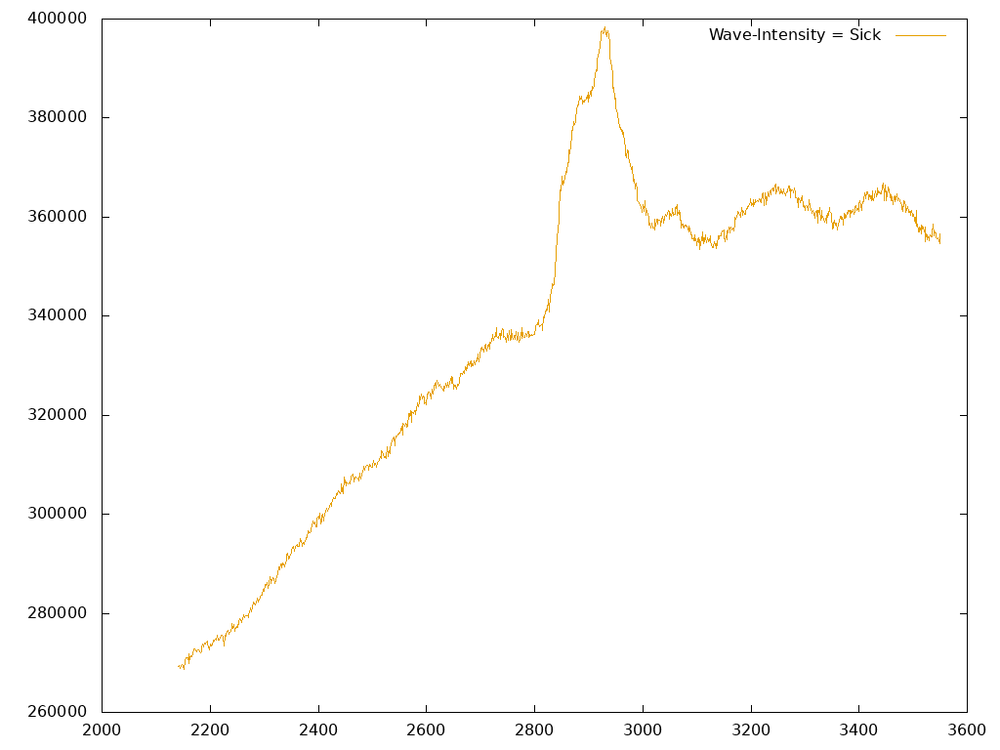
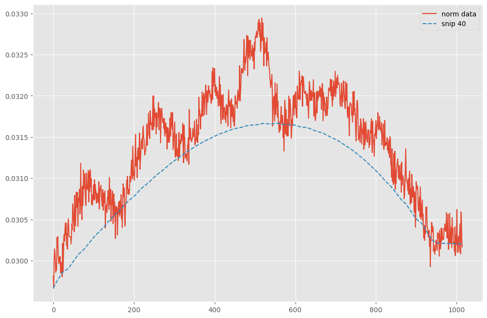
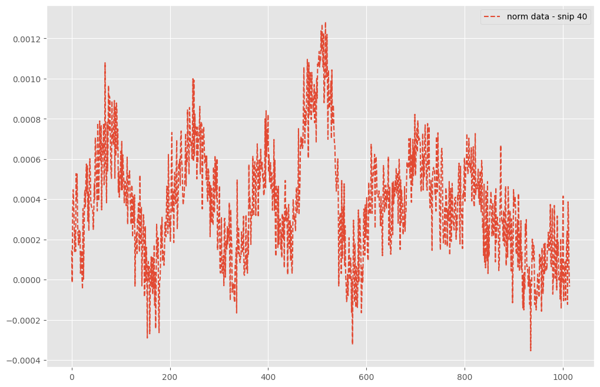
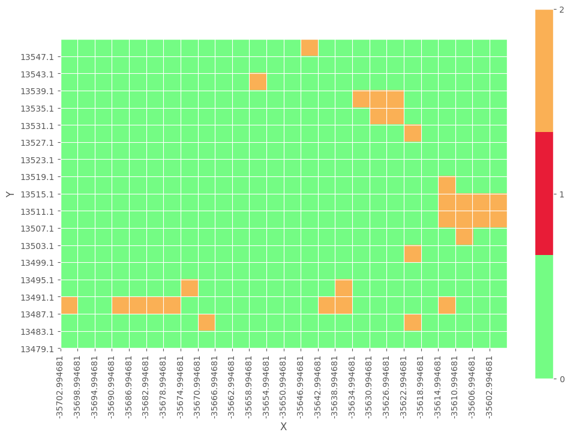

# RamanSpectroscopyCanserClassification
Бинарная классификация рамановской спектрограммы ткани головного мозга

## Задача
Есть 2 класса:
- Больная ткань
- Здоровая ткань

Необходимо на основе спектрограммы предсказать верную метку класса.

## Решение

Произведена спектральная предобработка, а именно:
- коррекция базовой линии (SNIP)
- нормализация

Классификация спектрограмм выполнена с помощью [Random Forest (Случайный лес)](https://scikit-learn.org/stable/modules/generated/sklearn.ensemble.RandomForestClassifier.html) модели.

Реализовано добавление 3-го класса для неуверенных прогнозов модели, зависит от выставлении соответсвующего порога.

## Входные данные
Данные получены из лаборатории с помощью рамоновского спектрометра.

На оси OX длина волны, на оси OY интенсивность.

Есть данные о 16 пациентах, у 6 из которых глиома головного мозга. Для каждого пациента спектрометр выдает около 430 спектрограмм, для разных координат ткани.

## Предобработка

- Нормализация для приведения данных к единому масштабу
- Фильтр SNIP (Symmetric Noise-Immune Peak) используется для сглаживания данных и удаления фона, основан на вычитании сигнала с помощью алгоритма итеративного отсечения пиков, лежащих ниже локальных минимумов.

| SNIP                                                  | Вычитание базовой линии                               |
|:-----------------------------------------------------:|:-----------------------------------------------------:|
|                                  |          |

## Визуализация

Есть возможность вывести карту прогнозов для спектрограммы, удобный формат для дальнейшего анализа ткани.

+ 0 - соответствует отрицательному классу. Здоровый
+ 1 - соответствует положительному классу. Больной
+ 2 - неопределенный результат.

## Результат

**Точность классификации: F1: 0.91, Accuracy: 0.935**
