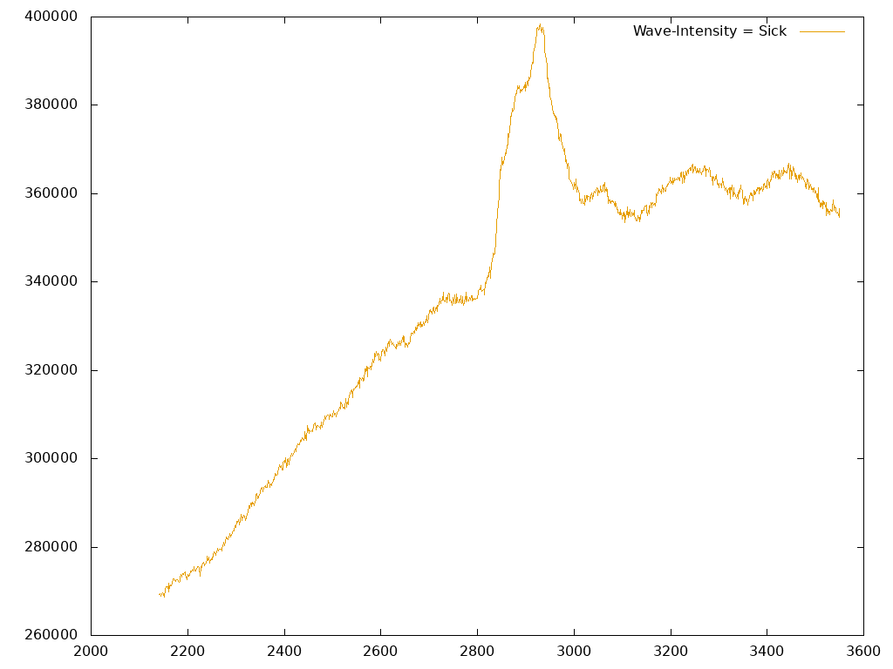

# RamanSpectroscopyCanserClassification
Спектральная предобработка рамановских данных при построении модели машинного обучения в рамках курсовой работы

### **Ongoing**

### Задача

Классификация срезов тканей глиомы головного мозга на два класса: больная и здоровая ткань. 

Произведена спектральная предобработка данных комбинационного рассеяния, полученных из лаборатории с помощью рамановского
спектрометра, и классификация спектрограмм разных участков тканей при помощи модели машинного обучения.

### Спектральная предобработка

Подготовка и очистка данных комбинационного рассеяния, полученных из лабораторных спектрограмм:

На этом этапе будут использоваться такие методы, как уменьшение шума, который может возникать из-за флуоресценции или мешающего окружающего света, коррекция базовой линии, для удаления неспецифического фонового сигнала из рамановского спектра, а также нормализация данных, чтобы убедиться, что они подходят для использования при построении модели.

### Входные данные

На оси OX длина волны, на оси OY интенсивность.

Есть данные об 12 пациента, у 4 из которых глиома головного мозга. Для каждого пациента спектрометр выдает около 430 спектрограмм, разных координат ткани

Исследованы некоторые модели машинного обучения, нейронная сеть. Промежутоная модель использует catboost.

**Точность классификации: F1 0.89, accuracy 0.89**

Исследование в процессе.
